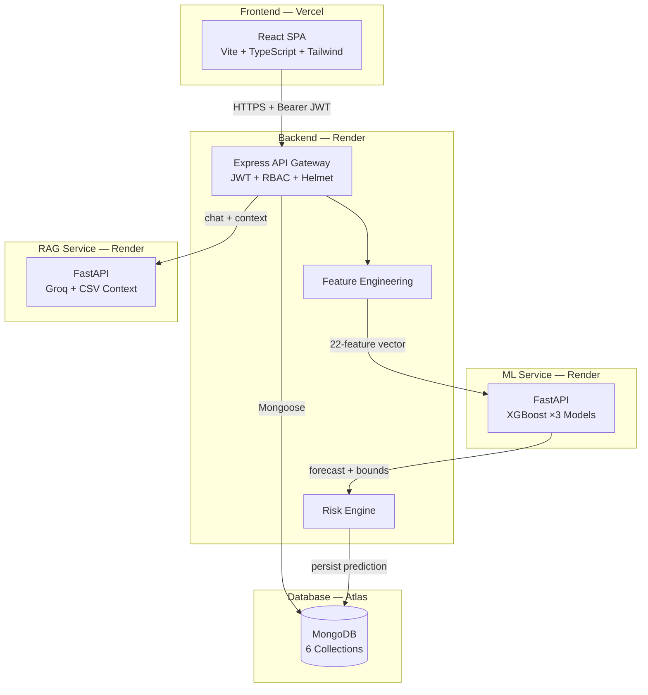
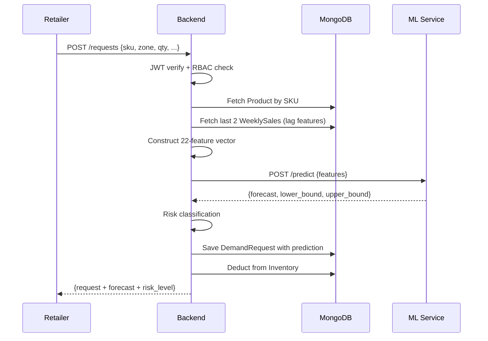
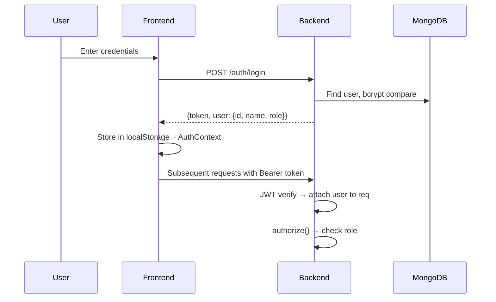

<p align="center">
  
</p>

<h1 align="center">Fluxo AI Supply Chain</h1>

<p align="center">
  <strong>An ML-powered supply chain decision engine that transforms demand uncertainty into actionable intelligence.</strong>
</p>

<p align="center">
  
  
  
  
  
  
  
  
</p>

<p align="center">
  <a href="#the-problem">Problem</a> •
  <a href="#core-features">Features</a> •
  <a href="#system-architecture">Architecture</a> •
  <a href="#product-walkthrough">Walkthrough</a> •
  <a href="#tech-stack">Stack</a> •
  <a href="#local-setup">Setup</a> •
  <a href="#deployment">Deploy</a>
</p>

---

## The Problem

Modern supply chains lose **$1.1 trillion annually** to inventory distortion — the gap between what's on the shelf and what should be. This breaks down into three core failures:

| Failure | Impact | Root Cause |
|---|---|---|
| **Demand Blindness** | Retailers order based on gut feeling, not data | No forecasting infrastructure |
| **Stockout Cascades** | One warehouse runs dry, triggering panic reorders across zones | No cross-warehouse visibility |
| **Overstock Waste** | Festival-period bulk orders rot when demand doesn't materialize | No seasonal intelligence |

Traditional ERP systems track *what happened*. They don't predict *what will happen*. Fluxo bridges this gap by embedding **XGBoost-driven demand forecasting** directly into the supply request workflow — every order is evaluated against a trained model before it touches inventory.

---

## Why Fluxo Was Built

This project started from a simple observation: **supply chain decisions are made in spreadsheets, not with machine learning.**

The goal was to build a system where:
- A retailer types *"Need 500 eggs for Zone A"* and the platform **automatically predicts demand, evaluates risk, and recommends an action** — before any stock is moved.
- A warehouse manager sees **projected shortages 7 days out**, not after they've already happened.
- An admin gets a **single-pane view** of inventory health, demand trends, and risk signals across all zones.

Fluxo is not a CRUD inventory app. It's a **Decision Support System** — an AI copilot for logistics teams.

---

## Core Features

### 🧠 AI-Powered Demand Forecasting
Triple XGBoost quantile regression models (median, lower bound, upper bound) generate **confidence-interval predictions** from a 22-feature vector constructed in real-time. The system reconstructs the exact training environment on every request.

### 💬 Natural Language Request Intake
Type *"Ship 1200 units of rice to Zone B, festival period"* — the Groq-powered LLM (Llama 3) extracts structured JSON (`product`, `quantity`, `zone`) and feeds it directly into the ML pipeline. No forms needed.

### 📊 RAG-Powered Analytics Chat
An AI analyst backed by **Retrieval-Augmented Generation** over 4MB of synthetic supply chain data. Ask questions like *"Which zone has the highest demand during festivals?"* and get data-grounded answers with actual numbers.

### 🔐 Role-Based Access Control
Three roles with enforced permissions at both API and UI layers:

| Role | Can Do | Cannot Do |
|---|---|---|
| **Admin** | Full system access, company settings, all data | — |
| **Retailer** | Create requests, view own predictions | Access other retailers' data, inventory mgmt |
| **Warehouse** | View inventory, manage stock, view zone requests | Create demand requests |

### 📈 Decision Intelligence Dashboard
Real-time metrics with Recharts visualizations: demand forecast area charts, seasonal pattern analysis, warehouse utilization gauges, risk distribution, and inventory health indicators — all driven by live API data.

### ⚡ Automated Risk Engine
Every supply request is classified against forecast confidence intervals:
- `requested_qty > upper_bound` → **High Overstock Risk**
- `requested_qty < lower_bound` → **Understock Risk**
- Within bounds → **Balanced**

### 🔄 Reorder Intelligence
Aggregation-based reorder suggestions computed from historical demand averages with configurable safety factors and sensitivity thresholds.

### 📦 Multi-Zone Inventory Management
Zone/warehouse filtering, stock adjustment workflows (inbound, outbound, threshold edits), transaction history tracking, and real-time stock projection bars.

---

## Product Walkthrough

```
1. LOGIN → JWT authentication, role assigned server-side
         ↓
2. DASHBOARD → Metrics, charts, system health, warehouse utilization
         ↓
3. CREATE REQUEST → Three input modes:
   ├── Structured Form (SKU, zone, qty, date, festival flag)
   ├── Bulk CSV Upload (multi-row validation)
   └── Natural Language ("500 eggs to Zone A")
         ↓
4. ML INFERENCE → 22-feature vector → XGBoost → forecast + confidence interval
         ↓
5. RISK ANALYSIS → Overstock/understock classification
         ↓
6. INVENTORY UPDATE → Stock deducted, transaction logged
         ↓
7. AI INSIGHTS → Ask the RAG assistant about trends, patterns, anomalies
         ↓
8. ADMIN SETTINGS → Company config, operational defaults, user overview
```

---

## System Architecture



### Request Lifecycle



### Auth Flow



---

## Tech Stack

| Layer | Technology | Why This Choice |
|---|---|---|
| **Frontend** | React 18 + TypeScript | Type safety across 10 pages, 15+ components |
| **Styling** | Tailwind CSS + shadcn/ui | Design system consistency with Radix primitives |
| **Charts** | Recharts | Composable chart components for demand visualizations |
| **Animation** | Framer Motion | Micro-interactions: row expansion, page transitions, hover states |
| **State** | TanStack Query | Server-state caching with automatic refetch on mutations |
| **Routing** | React Router v6 | Protected routes with role-based guards |
| **Backend** | Express 5 (Node.js) | Lightweight API gateway with middleware composition |
| **Database** | MongoDB + Mongoose | Schema flexibility for evolving supply chain models |
| **Auth** | JWT + bcrypt | Stateless auth with role-encoded tokens |
| **Security** | Helmet + express-rate-limit | HTTP headers hardening + brute-force protection |
| **ML Serving** | FastAPI + XGBoost | Sub-100ms inference with joblib-serialized models |
| **AI/NLP** | Groq API (Llama 3) | Fast LLM inference for NL parsing and RAG chat |
| **RAG** | Pandas + CSV context | Lightweight retrieval over 4MB supply chain dataset |

---

## ML Feature Engineering

The system constructs a **22-dimensional feature vector** in real-time, matching the exact training schema:

| Group | Features | Count |
|---|---|---|
| **Numerical** | `current_price`, `base_price`, `discount_percent`, `year_growth`, `month`, `is_festival`, `product_id`, `lag_1`, `lag_2` | 9 |
| **Zone (one-hot)** | South, West, East (North = baseline) | 3 |
| **Warehouse (one-hot)** | B, C (A = baseline) | 2 |
| **Category (one-hot)** | dairy, poultry, grains, vegetables, fruits, electronics, raw_materials, furniture | 8 |

The `lag_1` and `lag_2` features are fetched from the `WeeklySales` collection — the two most recent sales records for the product/zone/warehouse combination.

---

## Engineering Challenges

<details>
<summary><strong>1. RBAC That Actually Works</strong></summary>

The initial `authorize()` middleware was a no-op — it accepted role parameters but always called `next()`. This meant any authenticated user could access any endpoint. The fix required implementing proper role checking at both the API layer (middleware) and the UI layer (route guards), plus removing the frontend role dropdown that let users self-assign admin.
</details>

<details>
<summary><strong>2. The Double-Unwrap Bug</strong></summary>

The frontend's `handleResponse()` function auto-extracted `data.data` from API responses. But `loginUser()` then tried `data.data.token` — which was `undefined` because the data was already unwrapped. This caused silent auth failures where tokens were never stored. Fixed by making `handleResponse()` return raw JSON and having each API function explicitly access `.data`.
</details>

<details>
<summary><strong>3. Microservice Port Conflicts</strong></summary>

Both the ML service and RAG service defaulted to port 8000. They couldn't run simultaneously during local development. Resolved by making all ports env-driven (`process.env.PORT`) with distinct defaults (ML: 8001, RAG: 8000) and introducing `ML_SERVICE_URL` / `RAG_SERVICE_URL` env vars for production.
</details>

<details>
<summary><strong>4. Production Build CSS Ordering</strong></summary>

Vite's production build failed with `@import must precede all other statements` because Google Fonts was imported after `@tailwind` directives. CSS spec requires `@import` first — a rule that dev mode tolerates but production builds enforce.
</details>

<details>
<summary><strong>5. Express 5 Error Handling</strong></summary>

Express 5 changed error handling behavior from v4. The error middleware needed to properly handle both sync throws and async rejections while hiding internal error details in production (`NODE_ENV=production`).
</details>

---

## Security

| Layer | Implementation |
|---|---|
| **Authentication** | JWT with bcrypt password hashing (10 salt rounds) |
| **Authorization** | `protect` middleware (JWT verify) + `authorize` middleware (role check) |
| **Rate Limiting** | 20 requests / 15 minutes on `/auth/*` routes |
| **Headers** | Helmet.js (CSP, HSTS, X-Frame-Options, etc.) |
| **Input Validation** | Email regex, password ≥ 6 chars, payload schema checks |
| **Error Masking** | Internal errors hidden in production responses |
| **CORS** | Env-driven allowlist (`CORS_ORIGINS`) |
| **Secrets** | `.env` files gitignored, `.env.example` templates provided |

---

## Project Structure

```
fluxo/
├── frontend/                    # React SPA
│   ├── src/
│   │   ├── pages/               # Dashboard, Requests, Inventory, Insights, Admin, Profile
│   │   ├── components/          # AppLayout, Sidebar, Topbar, RequestIntakeDrawer
│   │   ├── context/             # AuthContext, UISettings, CompanyContext
│   │   ├── services/            # API client (fetch + JWT headers)
│   │   ├── types/               # TypeScript interfaces
│   │   └── hooks/               # Custom hooks (toast, mobile detection)
│   ├── .env                     # VITE_API_URL
│   └── .env.production          # Production API URL
│
├── backend/                     # Express API Gateway
│   ├── src/
│   │   ├── config/              # DB connection with retry logic
│   │   ├── controllers/         # Auth, Request, AI, Demand, Decision, Inventory
│   │   ├── middlewares/         # JWT protect, RBAC authorize, error handler
│   │   ├── models/              # User, Product, Inventory, DemandRequest, WeeklySales, Demand
│   │   ├── routes/              # Route definitions with middleware chains
│   │   └── services/            # Business logic, ML communication, auth
│   ├── seed-demo.js             # Database seeding script
│   └── server.js                # Entry point (async startup)
│
├── ml_service/                  # XGBoost Inference API
│   ├── models/                  # xgb_median.pkl, xgb_lower.pkl, xgb_upper.pkl
│   ├── app.py                   # FastAPI with /predict and /health
│   └── requirements.txt         # Python dependencies
│
├── fluxo-rag/                   # RAG Chat Service
│   ├── data/                    # synthetic_supplychain_data.csv (4MB)
│   ├── main.py                  # FastAPI with /chat, /health, /data-check
│   └── requirements.txt         # Python dependencies
│
├── render.yaml                  # Render Blueprint (all 3 services)
├── dataset_generator.ipynb      # Synthetic data generation
├── demand_forecasting_model.ipynb  # Model training notebook
└── .gitignore
```

---

## API Reference

| Method | Endpoint | Auth | Description |
|---|---|---|---|
| `POST` | `/auth/register` | Public | Register (name, email, password) |
| `POST` | `/auth/login` | Public | Login → JWT + user object |
| `GET` | `/health` | Public | Backend health check |
| `GET` | `/inventory` | `warehouse`, `admin` | List inventory items |
| `POST` | `/inventory` | `warehouse` | Create/adjust inventory |
| `GET` | `/requests` | `retailer`, `warehouse`, `admin` | List requests (role-filtered) |
| `POST` | `/requests` | `retailer` | Create request → ML inference |
| `GET` | `/demand` | Authenticated | Demand analytics |
| `POST` | `/demand` | Authenticated | Log demand data |
| `GET` | `/decision/reorder` | Authenticated | Reorder suggestions |
| `POST` | `/api/ai/chat` | Authenticated | RAG chat with AI analyst |
| `POST` | `/api/ai/parse` | Authenticated | NLP → structured JSON |

---

## Local Setup

### Prerequisites
- Node.js 18+
- Python 3.10+
- MongoDB (local or Atlas)

### 1. Clone & Install

```bash
git clone https://github.com/MithunSrinivas28/Fluxo_AI_Supplychain.git
cd Fluxo_AI_Supplychain
```

### 2. Backend

```bash
cd backend
npm install
cp .env.example .env
# Edit .env: set MONGO_URI, JWT_SECRET, GROQ_API_KEY
npm run dev
```

### 3. ML Service

```bash
cd ml_service
python -m venv venv
# Windows: venv\Scripts\activate | macOS/Linux: source venv/bin/activate
pip install -r requirements.txt
uvicorn app:app --port 8001
```

### 4. RAG Service

```bash
cd fluxo-rag
python -m venv venv
# Windows: venv\Scripts\activate | macOS/Linux: source venv/bin/activate
pip install -r requirements.txt
cp .env.example .env
# Edit .env: set GROQ_API_KEY
uvicorn main:app --port 8000
```

### 5. Frontend

```bash
cd frontend
npm install
# .env already has VITE_API_URL=http://localhost:5000
npm run dev
```

### 6. Seed Demo Data

```bash
cd backend
node seed-demo.js
```

> **Demo credentials:** `mithunsrinivas28@gmail.com` / `123` (admin role)

---

## Deployment

### Architecture

```
Vercel (Frontend) → Render (Backend) → MongoDB Atlas
                         ├──→ Render (ML Service)
                         └──→ Render (RAG Service)
```

### Deploy Order

1. **MongoDB Atlas** — Create cluster, get connection string
2. **ML Service** → Render (root: `ml_service`, start: `uvicorn app:app --host 0.0.0.0 --port $PORT`)
3. **RAG Service** → Render (root: `fluxo-rag`, start: `uvicorn main:app --host 0.0.0.0 --port $PORT`)
4. **Backend** → Render (root: `backend`, start: `node server.js`)
5. **Frontend** → Vercel (root: `frontend`, build: `npm run build`, output: `dist`)
6. **Seed database** — Run `seed-demo.js` with production `MONGO_URI`

### Required Environment Variables

<details>
<summary><strong>Backend (Render)</strong></summary>

| Variable | Description |
|---|---|
| `PORT` | Auto-set by Render |
| `NODE_ENV` | `production` |
| `MONGO_URI` | MongoDB Atlas connection string |
| `JWT_SECRET` | 64-char random string |
| `JWT_EXPIRES_IN` | `1d` |
| `GROQ_API_KEY` | From [console.groq.com](https://console.groq.com) |
| `ML_SERVICE_URL` | Render ML service URL |
| `RAG_SERVICE_URL` | Render RAG service URL |
| `CORS_ORIGINS` | `https://fluxo.vercel.app` |
</details>

<details>
<summary><strong>RAG Service (Render)</strong></summary>

| Variable | Description |
|---|---|
| `PORT` | Auto-set by Render |
| `GROQ_API_KEY` | Same Groq key |
| `GROQ_MODEL` | `llama-3.3-70b-versatile` |
</details>

<details>
<summary><strong>Frontend (Vercel)</strong></summary>

| Variable | Description |
|---|---|
| `VITE_API_URL` | Render backend URL |
</details>

A `render.yaml` blueprint is included for one-click Render deployment.

---

## Screenshots

> Screenshots of the running application will be added here.

| View | Description |
|---|---|
| **Dashboard** | Metrics, demand charts, warehouse utilization, system health |
| **Requests** | ML-enriched request queue with decision intelligence panels |
| **Inventory** | Zone/warehouse filtering, stock levels, transaction history |
| **Insights** | RAG-powered AI chat with supply chain data |
| **Admin** | Company settings, operational defaults, platform guide |

---

## Future Roadmap

- [ ] **Real-time pipeline** — Kafka/Redis streams for live inventory events
- [ ] **Anomaly detection** — Isolation Forest on demand patterns
- [ ] **Multi-warehouse optimization** — Linear programming for cross-zone allocation
- [ ] **Predictive procurement** — Auto-generate POs from forecast signals
- [ ] **Model retraining pipeline** — Scheduled retraining with MLflow tracking
- [ ] **WebSocket notifications** — Push alerts for stockout predictions
- [ ] **Container orchestration** — Docker Compose → Kubernetes migration
- [ ] **Supplier scoring** — Reliability metrics from delivery data

---

## Lessons Learned

**On ML integration** — The hardest part wasn't training the model. It was reconstructing the exact 22-feature vector at inference time, with the same one-hot encoding order, the same lag feature extraction, and the same baseline categories. Any mismatch silently produces wrong predictions.

**On microservice communication** — Two services defaulting to the same port taught me to make *everything* env-driven from day one. Hardcoded URLs work in development until they don't.

**On auth** — Writing `authorize()` as a no-op "to implement later" meant the entire RBAC system was a facade for weeks. Security middleware should be strict by default and relaxed explicitly.

**On frontend-backend contracts** — The double-unwrap bug (`data.data.data`) was caused by the frontend and backend having different assumptions about response shape. A shared API contract (or at least a consistent unwrapping strategy) would have prevented hours of debugging.

**On production readiness** — The gap between "works on localhost" and "deploys on Render" is larger than expected. Missing `numpy` in requirements.txt, CSS import ordering, CORS configuration, DB retry logic — these are invisible in development but fatal in production.

---

## Author

**Mithun S** — Software Engineer

Built as a full-stack engineering project demonstrating system design, ML integration, and production deployment. Designed to showcase real-world supply chain problem-solving with modern web technologies and machine learning.

---

<p align="center">
  <sub>Built with precision. Deployed with confidence.</sub>
</p>
